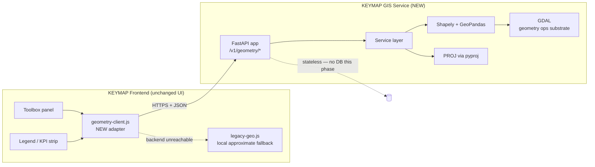

# KEYMAP Phase 1 — Python GIS Backend Microservice
## Technical Design & Implementation Plan (Option B, Approved)

**Status:** 🟡 Design only — awaiting approval. No code has been written to produce this document.
**Decision:** Supersedes the JS-native (JSTS) plan. KEYMAP is now explicitly on the platform track: a real Python GIS backend, not a browser-only tool that happens to have accurate geometry.
**Phase 1 scope, as instructed:** replace inaccurate geometry calculations only; keep every existing UI tool's appearance and trigger unchanged; ship API contracts for Buffer, Spatial Join, Intersection, Union, Area, Distance, and CRS transformation. **No PostGIS, no authentication, no other enterprise features this phase.**

---

## 1. What This Decision Actually Changes

The Phase 0 report named this the "Path B" fork and gated it deliberately behind an explicit choice, because it reverses a property that report listed as KEYMAP's core strength: **all data has stayed in the browser, with zero network calls other than map tiles, for the entire life of this project.** That ends here, for the specific operations this phase touches. This isn't a footnote — it's the central trade-off of the decision just made, and it's carried through every section below (see §6 Risks) rather than stated once and dropped.

What doesn't change: KMZ/KML import/export, the dashboard shell, panels, selection tools, the toolbox UI, i18n/RTL, undo/redo, session persistence — all of that stays exactly as it is. This phase touches the *implementation* behind seven specific operations, not the product around them.

---

## 2. Architecture Overview



The frontend adapter (`geometry-client.js`) is the same architectural idea the JS-native plan used for `geometry-engine.js` — one module is the *only* thing the toolbox is allowed to call for these seven operations. Here it makes HTTP calls instead of running JSTS locally, but the toolbox code calling it is identical either way. That earlier plan's isolation-boundary design was correct regardless of which engine ended up behind it; this document reuses it rather than re-deriving it.

**Statelessness is deliberate, not a placeholder for "add PostGIS later without thinking about it."** No database, no persistent storage, no request history retained server-side by default (see §6 on logging). Every request carries all the geometry it needs; every response is fully derivable from its request. This keeps Phase 1 genuinely simple — no migrations, no backup strategy, trivial horizontal scaling — and is the direct, correct interpretation of "no PostGIS yet."

---

## 3. API Design

### 3.1 Conventions (apply to every endpoint)

- **Base path:** `/v1/geometry/...` — versioned from day one so a breaking change later ships as `/v2/` without stranding the frontend.
- **Wire format:** GeoJSON geometry objects (`Polygon`, `MultiPolygon`, `Point`, `LineString`) — the natural common language between a Leaflet frontend and a Shapely/GeoPandas backend; no custom geometry encoding.
- **Batch-first, id-carrying:** every endpoint that operates on KEYMAP's real use case (an operation over N selected placemarks) accepts a `features: [{id, geometry, properties?}]` array and echoes `id` back in the response — the frontend maps results to placemarks by id, never by array position, so a partial failure or reordering can't silently mismatch a result to the wrong plot.
- **CRS is explicit, never assumed.** Every request accepts an optional `crs` (EPSG code, default `EPSG:4326`, matching what KML always was). Where an operation needs a *metric* CRS (buffer distance, area, distance-in-meters), the service auto-selects the correct local UTM zone from the geometry's centroid unless the caller passes `target_crs` explicitly — this replaces the old spherical-approximation math with a real projected calculation, not just a different approximation.
- **Errors:** a consistent shape — `{"error": {"code": "...", "message": "...", "detail": ...}}` — with standard HTTP status codes (400 invalid geometry, 413 payload too large, 422 validation, 500 unexpected).
- **Health check:** `GET /v1/health` → `{"status": "ok", "version": "..."}`, used by the hosting platform's liveness probe and by the frontend to decide whether to attempt the real backend or go straight to fallback.

### 3.2 `POST /v1/geometry/buffer`

Replaces the radial-offset approximation (`buildBuffer()`) that self-intersects on concave shapes.

**Request**
```json
{
  "features": [{"id": "PL-004", "geometry": {"type": "Polygon", "coordinates": [...]}}],
  "distance_m": 50,
  "cap_style": "round",
  "join_style": "round",
  "crs": "EPSG:4326"
}
```
**Response**
```json
{
  "results": [
    {"id": "PL-004", "geometry": {"type": "Polygon", "coordinates": [...]}, "area_m2": 18342.7}
  ],
  "crs": "EPSG:4326"
}
```
`cap_style`/`join_style` map directly to Shapely's `buffer()` parameters — exposed rather than hard-coded, since the current UI's single "buffer distance" input can grow a style dropdown later without an API change.

### 3.3 `POST /v1/geometry/spatial-join`

Replaces the centroid-in-polygon test (`spatialJoin()`) that misses real overlaps where a small plot's centroid falls outside the enclosing plot.

**Request**
```json
{
  "source_features": [{"id": "S1", "geometry": {...}, "properties": {"District": "North Sector"}}],
  "target_features": [{"id": "T1", "geometry": {...}}],
  "field": "District",
  "predicate": "intersects"
}
```
`predicate` ∈ `intersects | within | contains` — `intersects` is the default and the direct fix for the centroid-only defect; `within`/`contains` are exposed for future toolbox options without needing new endpoints.

**Response**
```json
{
  "matches": [{"target_id": "T1", "source_id": "S1", "value": "North Sector"}],
  "matched_count": 1,
  "target_count": 1,
  "unmatched_target_ids": []
}
```

### 3.4 `POST /v1/geometry/intersection`

Net-new capability — no equivalent exists in KEYMAP today.

**Request**
```json
{
  "features_a": [{"id": "A1", "geometry": {...}}],
  "features_b": [{"id": "B1", "geometry": {...}}],
  "min_area_m2": 1.0
}
```
**Response**
```json
{
  "intersections": [
    {"a_id": "A1", "b_id": "B1", "geometry": {...}, "area_m2": 214.5}
  ]
}
```
`min_area_m2` filters out floating-point sliver intersections (shared-edge artifacts) that are common with real-world adjacent survey polygons and would otherwise flood the result with noise.

### 3.5 `POST /v1/geometry/union`

Also net-new — **flagged explicitly: the current toolbox has no UI button that triggers this.** The contract is specified now per the instruction, and the backend implementation is real and usable via direct API call, but wiring a "Merge selected plots" toolbox tool to it is not assumed as part of this phase's UI (which is instructed to stay unchanged) — recommend treating that UI hook as an early Phase 2 item once this service is live, not a Phase 1 deliverable.

**Request**
```json
{ "features": [{"id": "P1", "geometry": {...}}, {"id": "P2", "geometry": {...}}] }
```
**Response**
```json
{ "geometry": {"type": "MultiPolygon", "coordinates": [...]}, "area_m2": 40221.9 }
```

### 3.6 `POST /v1/geometry/area`

Replaces the spherical-excess approximation used for the KPI strip's total-area figure and the toolbox statistics panel.

**Request**
```json
{ "features": [{"id": "P1", "geometry": {...}}] }
```
**Response**
```json
{ "results": [{"id": "P1", "area_m2": 4021.3, "area_ha": 0.402}] }
```

### 3.7 `POST /v1/geometry/distance`

**Scope note, surfaced deliberately:** the interactive Measure tool (live drag-on-map distance/area/angle HUD) stays client-side on the existing haversine math — sending an HTTP request per mouse movement during interactive measurement would make that tool feel broken. This endpoint serves *bulk/programmatic* distance (e.g., a future "distance between two selected plots' centroids" toolbox action, or distance-based filtering), not the live drag interaction. This is a design call, not an oversight — flagging it for confirmation rather than assuming it's obviously right.

**Request**
```json
{ "geometry_a": {"type": "Point", "coordinates": [37.9, 26.6]}, "geometry_b": {"type": "Point", "coordinates": [37.91, 26.61]} }
```
**Response**
```json
{ "distance_m": 1481.2 }
```

### 3.8 `POST /v1/geometry/reproject` (CRS transformation)

**Scope note:** no current UI tool calls this yet either — KEYMAP's format import stays KML/KMZ-only this phase (per the narrowed instruction; the earlier JS-native plan's GeoJSON/SHP import work is not part of this phase's contract). This endpoint is built ahead of its UI trigger deliberately: it's the direct enabler for SHP import in a later phase (SHP files are frequently in a local UTM zone, not WGS84), and shipping it now means that later phase is a frontend-only addition, not a backend one.

**Request**
```json
{
  "features": [{"id": "F1", "geometry": {...}}],
  "source_crs": "EPSG:32637",
  "target_crs": "EPSG:4326"
}
```
**Response**
```json
{ "features": [{"id": "F1", "geometry": {...}}], "target_crs": "EPSG:4326" }
```

---

## 4. Folder Structure

Recommend a **monorepo** — `backend/` alongside the existing frontend files at the repo root — so an API contract change and its frontend consumer land in the same PR/history, with each side still deploying independently (frontend → GitHub Pages, backend → a container host). Splitting into two repos later is a low-cost move if team ownership ever requires it; starting split would only add coordination overhead for a two-sided contract this size.

```
kmz-editor/                          # existing repo root
├── index.html                       # existing frontend build output — unchanged this phase
├── keymap_cdn.html
├── docs/
│   ├── reports/
│   └── plans/
│       ├── KEYMAP_Phase1_Spatial_Correctness_Plan.md   # superseded, kept for history
│       └── KEYMAP_Phase1_Backend_Architecture_Plan.md  # this document
│
└── backend/                         # NEW
    ├── app/
    │   ├── main.py                  # FastAPI instantiation, CORS, router mount, startup/health
    │   ├── api/
    │   │   └── v1/
    │   │       ├── router.py        # aggregates all routes under /v1
    │   │       ├── buffer.py
    │   │       ├── spatial_join.py
    │   │       ├── intersection.py
    │   │       ├── union.py
    │   │       ├── area.py
    │   │       ├── distance.py
    │   │       ├── reproject.py
    │   │       └── health.py
    │   ├── core/
    │   │   ├── config.py            # pydantic-settings: CORS origins, max body size, log level
    │   │   ├── geometry_io.py       # GeoJSON <-> Shapely conversion, id-preserving batch helpers
    │   │   ├── crs_utils.py         # auto-UTM-zone selection from centroid, pyproj wrapper
    │   │   └── logging.py           # structured logs; payload contents excluded by default
    │   ├── models/
    │   │   ├── requests.py          # Pydantic request models — the schemas in §3, made concrete
    │   │   └── responses.py
    │   └── services/                # HTTP-agnostic logic — testable without spinning up FastAPI
    │       ├── buffer_service.py
    │       ├── join_service.py
    │       ├── overlay_service.py   # intersection + union
    │       ├── measure_service.py   # area + distance
    │       └── crs_service.py
    ├── tests/
    │   ├── fixtures/                # SAME reference geometries as the superseded JS-native plan —
    │   │                            # concave polygon, polygon-with-hole, adjacent-not-overlapping,
    │   │                            # overlapping pair, known-exact-area square — reused verbatim,
    │   │                            # ported to GeoJSON files both engines can read
    │   ├── test_buffer.py
    │   ├── test_join.py
    │   ├── test_overlay.py
    │   ├── test_measure.py
    │   └── test_crs.py
    ├── pyproject.toml               # fastapi, uvicorn, shapely, geopandas, pyogrio, pyproj, pydantic-settings, pytest
    ├── Dockerfile
    ├── docker-compose.yml           # local dev: API container only, no DB
    ├── .env.example
    └── README.md

frontend changes (within the existing src/ area, once the modularization
from the Phase 0 report's §3.2 happens — otherwise inline in the current
single script, same functions, new implementation):
    geometry-client.js               # NEW adapter — HTTP calls to the backend, replacing the
                                      # relevant functions currently in geo.js
    legacy-geo.js                    # geo.js, kept as the offline/unreachable-backend fallback
                                      # (see §5 Stage 3) — not deleted this phase
```

---

## 5. Deployment Approach

**Statelessness makes this simpler than a typical backend** — no database means no migrations, no backup/restore strategy, and trivial horizontal scaling (any instance can answer any request). Worth stating plainly since "add a backend" often implies far more operational weight than this specific, deliberately-scoped service actually carries.

**Containerization:** a single Dockerfile, Python slim base. The one real packaging risk is GDAL — GeoPandas' traditional I/O backend (`fiona`) depends on the GDAL C library being present at the OS level, a frequent source of "works locally, breaks in the container" failures. **Recommendation: use GeoPandas with the `pyogrio` engine** instead of `fiona` — it ships GDAL as a self-contained wheel with far fewer system-dependency surprises, which matters even though Phase 1 doesn't do file I/O yet, because GeoPandas' internal geometry operations pull in the same dependency chain regardless.

**Hosting options:**

| Option | Cost profile | Ops burden | Recommended when |
|---|---|---|---|
| **Cloud Run / Azure Container Apps** *(recommended default)* | Scale-to-zero — near-zero cost when idle | Low — managed HTTPS, no patching | Default choice for a Phase 1 pilot with intermittent, unpredictable usage |
| Render / Fly.io / Railway | Cheap, simple free tier | Low | Fastest to stand up if platform choice isn't otherwise constrained |
| Self-hosted VM + Docker + Caddy | Fixed cost, more control | Higher — you patch it | If RCU has an existing hosting mandate, or a **data residency requirement** (see below) |

**Data residency — confirm before choosing a region.** RCU is a Saudi government-affiliated entity; if land-use/plot data is classified in a way that requires staying within Saudi Arabia (or a specific cloud region), that constrains the hosting choice materially and should be settled before deployment, not discovered after. This is flagged as an open question for you to confirm, not decided here.

**CORS:** locked explicitly to known frontend origins (the GitHub Pages domain, `localhost` for development, and the `claude.ai` artifact domain if that deployment path stays in use) — never a wildcard. With no authentication this phase, an open CORS policy plus an open API is the one combination to specifically avoid.

**Other guardrails appropriate without full auth:** a request body size limit (a bulk operation over thousands of plots is a multi-MB GeoJSON payload — cap it and return a clear `413` rather than let the process degrade), a request timeout, and basic rate limiting (e.g., `slowapi`) — not authentication, but enough to keep an accidentally-discovered-URL scenario from becoming a real incident before auth lands in a later phase.

**Observability:** structured logs (request id, operation name, feature count, duration) — enough to debug a production issue — with **geometry payload contents excluded from logs by default**, a direct, concrete mitigation for the data-leaves-the-browser concern in §6.

---

## 6. Migration Plan

1. **Backend skeleton, deployed but not yet called.** FastAPI app, health endpoint, CORS, Dockerfile, deployed to a staging environment. The five reference fixtures from the superseded plan (concave polygon, polygon-with-hole, adjacent-not-overlapping pair, overlapping pair, known-exact-area square) are ported to GeoJSON and asserted against server-side — not because Shapely's correctness is in doubt, but because the *conversion and integration code* (GeoJSON↔Shapely, CRS auto-selection, batch id-mapping) is exactly the kind of glue code that introduces bugs even when the underlying engine is trustworthy.
2. **Implement and deploy the seven endpoints**, each with its own test suite, behind `/v1/`.
3. **Frontend adapter with a feature flag.** `geometry-client.js` is built with an explicit switch between "local approximate math" (today's behavior, unchanged) and "backend-accurate math," per operation — not an all-or-nothing cutover. This makes each subsequent stage independently reversible without a redeploy if the backend has an incident.
4. **Staged cutover, highest-value first:** Buffer → Area (KPI/stats) → Spatial Join → Overlap/duplicate detection (via `/intersection`). Each stage: flip the flag, monitor, then move to the next — the same "swap the implementation, not the UI" pattern as the superseded plan, just pointed at HTTP instead of JSTS.
5. **Regression verification**, same method as before: diff old-vs-new results on the real ~2,785-plot merged dataset, manually trace every changed number to the fixtures' ground truth before calling a stage complete.
6. **Graceful degradation, decided explicitly rather than left open:** when the backend is unreachable or times out, the toolbox shows a clear "Backend unavailable — using approximate local calculation" indicator and falls back to `legacy-geo.js` rather than hard-failing the tool. This preserves KEYMAP's historical resilience as a *degraded-but-functional* mode instead of an outage — recommended default, flagged for confirmation like everything else in this section.

---

## 7. Risks

| Risk | Severity | Mitigation this phase |
|---|---|---|
| **Data now leaves the browser** — the single largest reversal of a property the Phase 0 report named as a core strength | **High — needs an explicit decision, not just a mitigation** | Send geometry only, not full attribute tables, where an endpoint doesn't need them; no persistent server-side storage; payload contents excluded from logs. **If RCU's data classification treats plot boundaries as sensitive, get governance sign-off before this reaches production — that's a decision for RCU, not an engineering mitigation.** |
| **No authentication** — the API is reachable by anyone who has the URL | High, but temporary by design | CORS origin lock + body-size limit + rate limiting this phase; explicitly **not** a substitute for real auth — flag clearly that this posture must not persist past a small trusted pilot |
| **Availability dependency** — Buffer/Join/Intersection/Area/Union/Distance/Reproject now require network + a healthy backend | Medium | Graceful degradation to local approximate math (§6.6) keeps the tool usable, just less accurate, during an outage |
| **GDAL packaging fragility** — the classic "works locally, breaks in the container" failure class | Medium | `pyogrio`-backed GeoPandas I/O instead of `fiona`; budget explicit time for this in the skeleton stage rather than assuming it'll be smooth |
| **Payload size / latency at scale** — a bulk area recompute over ~2,785 plots is a multi-MB request | Medium | Explicit body-size limits; load-test against the real dataset size before any cutover, not after |
| **API/frontend version coupling** — a response-shape change breaks the frontend silently if uncaught | Medium | `/v1/` versioning from day one; contract tests exercising both sides recommended once CI exists |
| **Cost** — no longer free to run, and now has an owner responsibility (monitoring, incidents) that didn't exist before | Low–Medium | Scale-to-zero hosting minimizes but doesn't eliminate this; still needs a named owner, not just a deployed service |
| **Integration-code correctness** — the risk isn't Shapely being wrong, it's the glue around it | Medium | Fixture-based tests ported from the superseded plan, run server-side before any endpoint is called by the frontend |

---

## Next Step

Confirm before implementation starts:

1. **§5 hosting** — Cloud Run/Azure Container Apps as the default, or is there a data-residency requirement that fixes the region/provider first?
2. **§6.6 graceful degradation** — fall back to local approximate math on backend outage (recommended), or should the tool hard-block with an error instead?
3. **§3.7/§3.8 scope notes** — confirmed that Distance and CRS-transformation endpoints ship ahead of any UI trigger this phase (API-ready, wired in a later phase)?
4. **§7 data governance** — has RCU's data classification for plot/land-use geometry been checked against "leaves the browser to a hosted service," or does that need to happen before this ships past a pilot?

Once these are confirmed, backend skeleton work (§6, Stage 1) can start.
