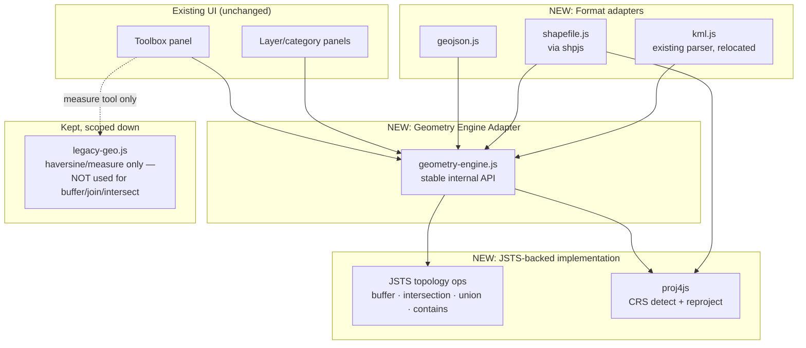

# KEYMAP Phase 1 — Spatial Correctness Foundation
## Technical Design & Implementation Plan

**Status:** 🔴 SUPERSEDED — the user explicitly chose Option B (Python backend, Shapely/GeoPandas/GDAL/PROJ) instead of the JS-native path this document defaulted to. See [KEYMAP_Phase1_Backend_Architecture_Plan.md](./KEYMAP_Phase1_Backend_Architecture_Plan.md) for the current plan. Kept here for decision-history traceability, not as an active design.
**Scope:** Spatial engine correctness only. No AI, no auth/multi-user, no 3D, no automation — per explicit instruction, those remain later phases from the [Phase 0 Improvement Report](./KEYMAP_Geospatial_Intelligence_Improvement_Report.md).
**Depends on:** One architecture decision, addressed in §0 below, defaulted per auto-mode rules because it went unanswered.

---

## 0. The Decision This Plan Had to Make Without You

Shapely, GeoPandas, GDAL, and PROJ are Python libraries. They cannot run natively in a browser, and KEYMAP today has zero backend (confirmed in the Phase 0 report: 0 `fetch()` calls other than map tiles). Naming those libraries specifically means one of three real architectures, and I asked which you wanted before writing this plan — the question went unanswered, so per the standing instruction to make the reasonable call and keep going rather than block, **this plan targets Option A below**. If you actually want Option B (the literal Shapely/GeoPandas/GDAL stack), say so and I'll rewrite §2–§6 for it — the shape of the work changes substantially, so it's worth confirming rather than discovering three milestones in.

| | **A — JS-native engine (this plan)** | **B — Python backend microservice** | **C — Pyodide/WASM in-browser Python** |
|---|---|---|---|
| Engine | **JSTS** — the JS port of JTS, the same algorithm lineage GEOS (and therefore Shapely, PostGIS, QGIS) is built on | Actual Shapely + GeoPandas + GDAL + PROJ behind FastAPI | Actual Shapely via Pyodide WASM wheels |
| CRS transforms | **proj4js** — implements the PROJ.4 parameter spec directly | PROJ (C library) | pyproj (WASM support immature) |
| Format I/O | shpjs (SHP), native JSON (GeoJSON), existing KML/KMZ parser | GDAL/OGR — 100+ formats, incl. raster | Fiona/GDAL — same WASM immaturity issue |
| Infrastructure | **None** — zero-infrastructure model preserved | New backend: hosting, deploy, CORS, uptime | None, but very large first-load download |
| Matches the literal ask | Same algorithm lineage, different language | **Exactly**, by name | Exactly, by name, but high implementation risk |
| Risk this phase | Low — ships standalone | Medium-high — new ops surface mid-"foundation" phase | High — GDAL/GeoPandas WASM maturity is the open question |

**Why A is the default, not just the easy option:** the brief for this phase says "do not add... enterprise features yet." A backend — hosting, deployment, CORS, uptime — is infrastructure, and stands up the exact Path B decision the Phase 0 report deliberately gated behind a separate sign-off, not something to back into as a side effect of a geometry-correctness fix. JSTS is not a lesser substitute chosen for convenience: it and GEOS are sibling ports of the same JTS algorithms, and JSTS is production-proven in serious web GIS tooling. What you lose versus real GDAL is broad-format raster/vector I/O — irrelevant here, since KEYMAP is vector-only and the requested formats (GeoJSON/KMZ/SHP) are all covered without it.

**If you want Option B instead:** the technical design, dependency list, file structure, and roadmap in §2–§6 would be replaced with a FastAPI service design (Shapely/GeoPandas/GDAL/pyproj), a REST contract for KEYMAP to call, deployment target (Docker + a host), and an auth-less-but-CORS-locked-down security posture for Phase 1. Say the word and I'll produce that version instead of, or alongside, this one.

---

## 1. What "Spatial Correctness" Fixes, Concretely

From the Phase 0 report (§2.3), three specific defects exist today, all in the current hand-rolled math:

| Current defect | File | Why it's wrong |
|---|---|---|
| Buffer offsets each vertex radially from the polygon centroid | `geo.js` → `buildBuffer()` | Self-intersects on concave polygons; not a true geodesic buffer; no join style (round/miter/bevel) |
| Spatial join / overlap detection test **centroid-in-polygon** only | `geo.js` → `spatialJoin()`, `findDuplicates('overlap')` | A large polygon that surrounds a small one without containing its *centroid* is missed entirely |
| No real intersection/overlay operation exists at all | — | Requested capability ("Intersection analysis") — new, not a fix |

Everything in this plan exists to close exactly these three gaps, plus the two adjacent items the brief explicitly names (GeoJSON/SHP processing, real CRS handling) that the current KML-only, always-WGS84 design has no path to today.

---

## 2. Technical Design

### 2.1 Target Architecture



**The adapter is the whole point.** Every existing toolbox call site (`buildBuffer()`, `spatialJoin()`, `findDuplicates()`) currently calls hand-rolled functions directly. Phase 1 introduces `geometry-engine.js` as the *only* thing the UI is allowed to call, with a stable function signature per operation. The JSTS implementation sits behind it. This means:

- The UI code in `shell.js`/`geo-ui.js` **does not change** — same button, same click handler, same toast message shape.
- If Option B is chosen later, only the adapter's *implementation* swaps to call a backend instead of JSTS — the UI layer is already isolated from that decision.
- Rollback is a one-line import swap, not a UI rewrite.

### 2.2 Component Design

**`geometry-engine.js`** — the adapter. Exposes exactly the operations the toolbox needs, each taking/returning KEYMAP's existing `[lat, lng]` ring format at the boundary (so callers never see JSTS's internal geometry objects):

```
bufferPlacemarks(placemarks, distanceMeters, opts?) → GeoJSON-like ring set
intersect(geomA, geomB) → ring set | null (no overlap)
union(geomA, geomB) → ring set
spatialJoin(sourcePlacemarks, targetPlacemarks, field) → {matched, results}   // full polygon test, not centroid-only
containsPoint(geom, latlng) → boolean                                        // replaces hand-rolled ray casting
trueArea(geom) → number (m²)                                                 // JSTS + proj'd equal-area calc, replaces spherical-excess approximation
```

Internally: convert `[lat,lng]` rings → JSTS `Geometry` via a small WKT or coordinate-array bridge, run the JSTS operation, convert back. This conversion boundary is intentionally the *only* place JSTS-specific code exists outside the adapter.

**`crs.js`** — wraps `proj4js`. Maintains a small registry of CRSes actually relevant to this deployment (WGS84 always; common Saudi Arabia UTM zones 37N/38N/39N as named presets) plus generic EPSG-code lookup via a bundled minimal `proj4` definitions subset (not the full EPSG database — that's a size/scope trade-off called out in §4). Two functions: `detectCrs(prjFileText | geojsonCrsMember)` and `reprojectToWgs84(coords, fromCrs)`.

**`formats/geojson.js`** — thin: `JSON.parse` + a validator (rejects non-Feature/FeatureCollection input with a clear error) + a mapper into KEYMAP's placemark shape (reuses the existing `buildPlacemark()`-style logic, generalized to not assume a KML node).

**`formats/shapefile.js`** — wraps `shpjs`, which internally parses `.shp`+`.dbf`+`.shx` from a zipped upload and already extracts the `.prj` WKT if present. Passes that WKT to `crs.js` for reprojection. If no `.prj` is present, prompts the user to pick a CRS from the registry rather than silently assuming WGS84 (today's KML path gets away with silently assuming WGS84 only because KML *is* always WGS84 — SHP is not, and guessing wrong here corrupts geometry silently).

**`formats/kml.js`** — the existing, working KML/KMZ parser, relocated out of the monolith with **no logic changes**. Explicitly not in scope for correctness work — it isn't broken.

**`legacy-geo.js`** — the current `geo.js` file, kept but reduced in responsibility: it retains `haversine`/`bearingDeg`/`angleAt` for the **measure tool only** (distance/bearing/angle between clicked points — not a polygon operation, no correctness defect exists there today). Everything with a known defect (`buildBuffer`, `spatialJoin`, `ringAreaM2`/`placemarkAreaM2` used for the *KPI area total and stats*, overlap detection) migrates to the new engine. This file is explicitly marked for removal once migration is verified (§3, Milestone 4).

### 2.3 New Capability: Intersection Analysis

Not a fix — a net-new toolbox tool, since none exists today. Design: user selects two layers (same picker UX as the existing Spatial Join tool); the tool computes the true polygon intersection for every pair of plots across the two layers using `geometry-engine.intersect()`, and either (a) reports the count and total overlap area, or (b) draws the intersection geometry as a new temporary overlay layer (same visual pattern already used for the buffer preview). Selecting mode (a) vs (b) is a UI decision, not an architecture one — recommend building (a) first since it reuses the existing stats-panel pattern, and (b) as a fast-follow within the same milestone if time allows.

### 2.4 Correctness Verification Strategy

This is the part that actually earns the word "foundation" — a swap that isn't independently verified is just a different set of unverified math. Plan:

1. **Reference fixtures**: a small hand-built test dataset with known correct answers — a concave (L-shaped) polygon, a polygon with a hole (donut), two adjacent-but-not-overlapping plots, two genuinely overlapping plots, and one plot whose area is known precisely (e.g., a 100m × 100m square at a known latitude, expected area = 10,000 m² exactly). These live in `tests/fixtures/`.
2. **Unit tests against the fixtures**, asserting exact or near-exact (floating-point-tolerant) expected results for buffer, intersect, area, and contains.
3. **Regression comparison on real data**: run both the old and new engines against the ~2,785-plot merged RCU dataset already used in prior verification, and diff the results (selection counts from duplicate/overlap detection, spatial join match counts, total area KPI). Differences are expected and are the point — each one gets manually checked against the fixtures' ground truth to confirm the *new* number is the correct one, not just a different one.
4. **No cutover without both passing** — this gates Milestone 4 in the roadmap below.

---

## 3. Migration Plan

**Principle: introduce before you switch, switch before you delete.** Five stages, each independently shippable:

| Stage | What happens | UI-visible change |
|---|---|---|
| **1. Foundation** | Add JSTS/proj4/shpjs as dependencies; build `geometry-engine.js` and `crs.js`; write fixtures + unit tests. No toolbox code calls the new engine yet. | None |
| **2. Format expansion** | Wire `geojson.js` and `shapefile.js` into the existing multi-file import flow (same "Load KMZ file" picker, extended to accept `.geojson`/`.json`/`.zip`). | New file types importable |
| **3. Buffer cutover** | Swap `buildBuffer()`'s implementation to call `geometry-engine.bufferPlacemarks()`. Old function kept, unused, behind a feature flag for one milestone in case of regression. | Buffer tool produces visibly different (correct) output on concave shapes |
| **4. Join/overlap/area cutover** | Swap `spatialJoin()`, `findDuplicates('overlap')`, and the KPI-strip/stats-panel area calculation to the new engine. | Spatial join catches cases centroid-only logic missed; area totals shift slightly (become more accurate, not "wrong") |
| **5. New capability + cleanup** | Ship Intersection Analysis as a new toolbox section. Remove the now-dead buffer/join/area code from `legacy-geo.js`, keeping only measure-tool functions. | New toolbox tool appears |

**Backward compatibility:** KML/KMZ import/export is untouched throughout — it was never part of the defect. Session persistence (IndexedDB) needs one additive change: placemarks gain an optional `sourceCrs` field (default `'EPSG:4326'` for existing/KML data), so old saved sessions load with no migration step required — the field is simply absent and treated as WGS84, which is what it always was.

**Rollback plan per stage:** because the adapter is the only integration point, rolling back any stage is reverting one function's implementation to call the old `legacy-geo.js` path instead of `geometry-engine.js` — not a data migration, not a UI change.

---

## 4. Dependencies

| Package | Role | Approx. size (minified) | License | Action needed |
|---|---|---|---|---|
| **jsts** | Topology engine — buffer, intersection, union, contains, area | ~180–250 KB for the operations subset (full library is larger; import only `operation/buffer`, `operation/overlay`, `algorithm` modules, not the whole package) | Eclipse Public License / Eclipse Distribution License (dual) | **Verify license compatibility** with how KEYMAP is distributed (currently a freely-shared single HTML file) before committing — EPL/EDL are permissive but have attribution requirements; confirm exact current version's license file before inlining |
| **proj4** (proj4js) | CRS definition parsing + coordinate reprojection | ~30–40 KB | MIT | None — well-understood, permissive |
| **shpjs** | Shapefile (.zip → geometry + attributes + .prj) parsing | ~90–120 KB (includes its own shapefile/dbf sub-parsers) | MIT | None |

**Bundle size impact:** current standalone build is 491 KB (JSZip + Leaflet inlined, zero external requests). Adding the above brings the standalone build to an estimated **~750–850 KB**, still a single self-contained file, still zero external requests at runtime. This is a real, honest cost — flagged explicitly rather than glossed over — and is the direct trade-off for keeping zero-infrastructure instead of moving weight to a backend (Option B would keep the *client* bundle small but add a server dependency instead). Recommend confirming this size increase is acceptable before Stage 1; if not, the fallback is lazy-loading JSTS only when a toolbox spatial operation is actually invoked (dynamic `import()`), at the cost of a brief delay on first use of those specific tools — worth deciding now rather than after the fact.

**Not adding:** GDAL, GeoPandas, Shapely, pandas, numpy, or any Python runtime — these are Option B's dependency list, not this plan's.

---

## 5. File Structure

Current state: one 236 KB HTML file, one inline `<script>`, 147 functions in a single IIFE. This plan proposes the minimum modularization needed to do Phase 1 safely — not the full refactor from the Phase 0 report's §3.2, which remains a separate, broader recommendation.

```
keymap/
├── src/
│   ├── core/
│   │   ├── geometry-engine.js      # NEW — the adapter (§2.2)
│   │   ├── crs.js                  # NEW — proj4 wrapper + CRS registry
│   │   └── legacy-geo.js           # RENAMED from geo.js — measure-tool math only after Stage 5
│   ├── formats/
│   │   ├── geojson.js              # NEW
│   │   ├── shapefile.js            # NEW
│   │   └── kml.js                  # RELOCATED — existing parser, unchanged
│   ├── toolbox/
│   │   ├── buffer.js               # RELOCATED from geo-ui.js — updated to call geometry-engine
│   │   ├── spatial-join.js         # RELOCATED — updated
│   │   ├── intersection.js         # NEW — §2.3
│   │   └── duplicates-overlap.js   # RELOCATED — updated
│   ├── shell.js                    # EXISTING — dashboard shell, unchanged
│   ├── panels.js                   # EXISTING — panel visibility system, unchanged
│   └── app.js                      # EXISTING — main IIFE, now importing the above instead of inlining them
├── tests/
│   ├── fixtures/
│   │   ├── concave-polygon.json
│   │   ├── polygon-with-hole.json
│   │   ├── adjacent-not-overlapping.json
│   │   ├── overlapping-pair.json
│   │   └── known-area-square.json  # 100m×100m at documented lat, expected area = 10,000 m²
│   └── geometry-engine.test.js
├── build/
│   └── vite.config.js              # bundles src/ back into ONE standalone HTML — deployment model unchanged
├── index.html                      # build output — same artifact GitHub Pages serves today
└── docs/
    └── reports/  (existing — Phase 0 report lives here)
    └── plans/    (this document)
```

**Why a build step now, if the deployment target is still "one HTML file":** without one, adding `geometry-engine.js` as a real ES module and pulling in `jsts`/`proj4`/`shpjs` from npm means either (a) hand-concatenating everything the way `build-standalone.js` currently inlines JSZip/Leaflet — which does not scale past two libraries — or (b) a proper bundler doing exactly that automatically, with tree-shaking to control the size growth flagged in §4. Vite is recommended specifically because it requires near-zero configuration and its default output can be a single HTML file, preserving the "download one file, open it, it works" deployment story exactly as it exists today.

---

## 6. Implementation Roadmap

Four milestones, matching the five migration stages (Milestone 3 covers two stages since they're low-risk together). No milestone here includes AI, auth, multi-user, or 3D work — those are out of scope per the brief and remain gated in the Phase 0 report's later windows.

| Milestone | Deliverables | Exit criteria |
|---|---|---|
| **M1 — Engine Foundation** | Vite build set up producing the same single-file output; `jsts`/`proj4`/`shpjs` added; `geometry-engine.js` + `crs.js` built; fixtures + unit tests written and passing | All 5 fixture tests pass; standalone build still opens and runs identically to today with zero toolbox behavior changed yet |
| **M2 — Format Processing** | `geojson.js`, `shapefile.js` wired into the import flow; CRS detection + reprojection verified against a real UTM-zone SHP sample | A GeoJSON file and a zipped Shapefile (with and without `.prj`) both import correctly, geometry lands in the right place on the map, CRS-less SHP prompts the user instead of silently assuming WGS84 |
| **M3 — Real Operations (Buffer + Intersection)** | Buffer tool cut over to JSTS; Intersection Analysis shipped as new toolbox tool | Buffer no longer self-intersects on the concave fixture; intersection tool returns correct overlap area on the known-overlap fixture |
| **M4 — Join/Overlap Cutover + Verification** | Spatial join and overlap/duplicate detection cut over; KPI/stats area calculation cut over; full regression diff against the real 2,785-plot dataset reviewed; `legacy-geo.js` reduced to measure-tool functions only; Phase 0 report's maturity scorecard (§2.3 "Spatial analysis: 2") updated to reflect the fix | Regression diff reviewed and every changed number traced to a real correctness improvement, not an unexplained discrepancy; old buffer/join/area code deleted, not just unused |

**Explicit non-goals, restated:** no LLM/AI work of any kind (Tier 1 GeoAI from the Phase 0 report stays out of scope), no backend/auth/multi-user work (unless you choose Option B in §0), no 3D/MapLibre work, no automation/scheduling. This phase is the geometry correctness fix and the three named formats — nothing else.

---

## Next Step

This is a plan, not a commit. Confirm:

1. **§0** — JS-native (JSTS/proj4/shpjs, this plan as written) or the Python backend (Option B, needs a rewrite of §2–§6)?
2. **§4** — is a ~750–850 KB standalone file acceptable, or should JSTS lazy-load on first toolbox use instead?
3. **§5** — is introducing a Vite build step (output unchanged: still one HTML file) acceptable, given the current single-script-tag deployment has no build step at all today?

Once those are confirmed, M1 can start.
