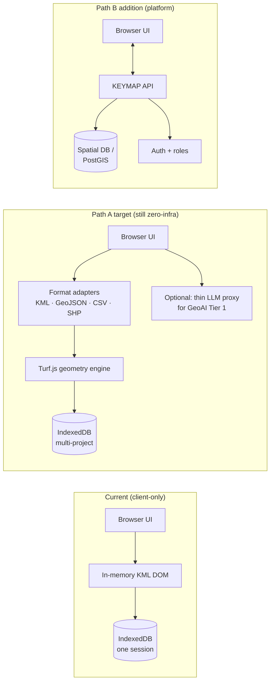

# KEYMAP — Geospatial Intelligence Platform
## Improvement Report & Enterprise Architecture Roadmap

**Prepared as:** Independent architecture assessment (analysis only — no code was modified to produce this report)
**Subject:** KEYMAP, a single-file browser-based GIS editor originally built for RCU AlUla land-use KMZ workflows
**Method:** Direct static analysis of the current production source (`index.html`, `keymap_cdn.html` in the `kmz-editor` repository), verified against the deployed build rather than design intent

---

## Scope & Methodology Note

Every factual claim about "what KEYMAP currently does" in this report was verified against the live source at the time of writing:

| Metric | Value |
|---|---|
| Source file size | 236 KB (`kmz_editor (2).html`) |
| Application logic | 165 KB JavaScript, 147 functions, single IIFE |
| Standalone bundle (JSZip + Leaflet inlined) | 491 KB, zero external script/style requests |
| Localisation | ~280 keys × 2 languages (AR/EN), full RTL mirroring |
| Backend calls | 0 (only map tile requests to OSM / Esri) |
| Confirmed format support | KMZ / KML (import + export) only |
| Confirmed spatial libraries | None — all geometry math is hand-written |
| Confirmed AI mechanism | Deterministic keyword/regex command parser, not a language model |

This grounding matters: the rest of the report evaluates a **real, working, zero-infrastructure browser tool**, not a concept. That is itself the most important fact about KEYMAP, and it shapes every recommendation below — the architecture that makes KEYMAP valuable (works with no server, no install, no IT ticket) is in direct tension with several of the capabilities requested for this roadmap (true GeoAI, digital twin, multi-user editing). Section 3 makes that tension explicit rather than papering over it.

---

## 1. Executive Summary

KEYMAP today is a **capable, well-engineered single-purpose browser tool**: load one or more KML/KMZ files, merge them, select and edit plots in bulk through a genuinely broad toolset (lasso/brush/rectangle selection, SQL-style filtering, duplicate/overlap detection, field calculator, spatial join, buffering, heatmap/clustering, measurement, bookmarks, undo/redo), and export a clean KMZ back out. It runs entirely client-side, which is a deliberate and valuable property in RCU's environment — this project has directly encountered CDN-blocking and restricted-network conditions during its own development, and KEYMAP's zero-dependency design is what keeps it usable there.

It is not, and should not yet be described as, a **Geospatial Intelligence Platform** in the sense the name and this report's brief imply. There is no server, no database, no multi-user model, no real spatial engine (all geometry math — buffering, centroids, area — is hand-rolled trigonometry, not a topology library), no format support beyond KML/KMZ, no 3D, and the "AI" is a rule-based command parser that explicitly does not understand natural language outside its matched patterns.

**Top strengths:** zero-infrastructure deployment; unusually complete bulk-editing and selection toolkit for a browser tool; real bilingual AR/EN UX with RTL done properly; an honest, working undo/redo and session-persistence model.

**Top gaps:** single-format data platform (KML/KMZ only); no real spatial/topology engine; no multi-user or server-of-record story; zero integrations; no 3D; "AI" is pattern-matching, not intelligence.

**Headline recommendation:** Do not chase feature parity with ArcGIS Enterprise or QGIS — that is a different category of product with a different cost structure. Instead, deliberately choose one of two paths this year: (a) harden KEYMAP as the best zero-infrastructure companion tool to RCU's real GIS of record, closing format and correctness gaps, or (b) commit real budget to a backend and treat this report's 12-month and 12–24-month sections as the start of an actual platform investment. Section 3 lays out both paths concretely; Section 9 assumes path (a) with clearly marked platform-investment gates.

---

## 2. Current Platform Assessment

Maturity scale used below: **0** absent · **1** prototype · **2** functional but narrow · **3** solid for its category · **4** production-grade · **5** enterprise-grade

| Dimension | Maturity | One-line verdict |
|---|:-:|---|
| GIS architecture | 2 | Clean in-browser data model; no service layer, no persistence beyond one browser |
| Data management | 1 | Single format in/out, no schema validation, no version history |
| Spatial analysis | 2 | Broad *toolset*, shallow *engine* — approximations, not GEOS-grade |
| Web GIS functionality | 2 | Strong editor, not a GIS server; no OGC services, no shareable views |
| Dashboard & visualization | 3 | Genuinely good for a single-file app — real computed KPIs, not mockups |
| 3D / digital twin readiness | 0 | No 3D rendering path exists; would require an engine swap |
| AI / GeoAI | 1 | Deterministic parser only; no model, no learning, no imagery AI |
| Automation | 1 | Bulk edit tools exist; no scheduling, no pipelines, no scripting API |
| API integrations | 0 | No REST API, no OGC client, no webhook, no external DB |
| Security & scalability | 2 (client), 0 (org) | Safe by virtue of having no server; no auth, no roles, no audit trail |
| User experience | 3 | Above-bar for the category: dark enterprise shell, i18n/RTL, real shortcuts |

### 2.1 GIS Architecture

KEYMAP holds one in-memory array of placemark objects (`{idx, node, name, fields, rings, styleId, deleted, dirty, sourceId}`), where `node` is a live reference into a parsed KML DOM — edits are written straight back into that DOM and serialized on export. This is a pragmatic design for a single-document editor and explains why undo/redo, multi-file merge, and export-selection-only all work reliably: there is one source of truth.

It is not an architecture that scales past "one browser tab, one active document." There is no separation between a data layer, a service layer, and a presentation layer in the way any real GIS platform (ArcGIS Enterprise's Portal/Server/Data Store split, or a GeoServer+PostGIS stack) requires. Compared to those, KEYMAP is architecturally closer to a well-built **desktop-in-a-browser plugin** than to a platform.

### 2.2 Data Management

**Confirmed:** import/export is KMZ/KML exclusively. Attribute fields are parsed from an RCU-specific HTML table embedded in each placemark's `<description>` CDATA — a format assumption baked deep into the parser (`parseDescriptionRows`/`buildDescriptionHtml`). Files with a different description format still render geometry and name but expose no editable fields, silently.

There is no schema validation (a field can hold any string), no required-field enforcement, no domain/lookup lists, and — until a bug fix earlier in this project's history — saving an edit could silently blank out non-RCU-formatted descriptions entirely. That specific defect is now fixed, but it illustrates the underlying risk class: **the data model has no safety net**, because there is no schema to validate against.

Versioning is limited to an in-memory undo stack (40 steps, lost on refresh unless the user explicitly saves) plus one IndexedDB slot holding "the current session." There is no audit trail of who changed what field to what value, which matters the moment more than one person touches the same export.

Compared to QGIS (native support for essentially every vector/raster format via GDAL/OGR, plus PostGIS/SpatiaLite backends) or ArcGIS (versioned enterprise geodatabase, branch versioning, full edit history), KEYMAP's data platform is the single largest capability gap in this report.

### 2.3 Spatial Analysis Capabilities

This is KEYMAP's most surprising strength *and* its most important hidden weakness at the same time.

**What exists and works:** a genuinely broad selection and analysis toolkit — rectangle/lasso/brush selection, SQL-style attribute filtering with AND/OR, duplicate detection (by geometry signature, by field value, or cross-file overlap), a field calculator (set/replace/prefix/suffix across a selection), basic statistics (count/sum/mean/min/max), a spatial join (copies a field from one layer onto another based on centroid containment), a buffer tool, a canvas-rendered heatmap, grid-based clustering, and a measurement tool (distance/area/angle) built on the haversine formula and spherical excess area.

**What it actually is under the hood:** every one of those operations is hand-written trigonometry, not a real geometry engine. The buffer tool offsets each vertex radially from the centroid by a fixed distance — this is a visual approximation that will self-intersect on concave polygons and does not produce a true geodesic buffer. The spatial join and overlap detection test centroid-in-polygon, not full polygon-polygon intersection, so a large polygon that surrounds a small one without containing its centroid will be missed. The clustering is degree-based grid binning, not a real density algorithm (DBSCAN/k-means). None of this is *wrong* for the plot sizes and use cases this tool has been tested against (RCU land-use parcels, hundreds to thousands of features), but it will produce incorrect results on adversarial or unusual geometry, and there is no way for a user to know that from the UI.

This is the one place in the assessment where the honest recommendation is not "add more tools" — it's **"replace the math under the tools that already exist"** before adding new ones on the same shaky foundation. See Section 3.3 and Section 9.

### 2.4 Web GIS Functionality

KEYMAP is a strong *editor*; it is not a *Web GIS* in the OGC sense. There is no way to serve a KEYMAP dataset to another application, no WMS/WFS/WMTS client or server capability, no shareable "view this map" link, and no embedding story. Every session lives and dies in one browser's IndexedDB.

### 2.5 Dashboard & Visualization

This is the strongest section of the current build, and worth stating plainly: the KPI strip, category breakdown, and feature inspector are **computed from real loaded data**, not placeholder numbers — total area is summed from an auto-detected area field, category counts come from actual style groupings, and the inspector shows real attribute values on click. For a single-file tool this is unusually disciplined; most comparable "demo" dashboards fake this. Canvas rendering (`preferCanvas`) was deliberately chosen over SVG and keeps thousands of polygons responsive, which was verified against a real merged dataset of 2,785+ RCU plots during development.

Gaps here are about breadth, not correctness: no charting beyond the simple category-breakdown bars, no time-series (no timestamp field is tracked), no cross-filtering between the KPI strip and the map, no printable/exportable report layout.

### 2.6 3D / Digital Twin Readiness

**Zero.** There is no 3D rendering path in the codebase at all — no MapLibre GL, no CesiumJS, no three.js, no WebGL. The map is Leaflet, which is a 2D-only library by design. This is not a "missing feature," it's a missing *engine* — see Section 5 for what actually closing this gap requires.

### 2.7 AI / GeoAI

KEYMAP AI is, by design and by explicit UI copy already in the product ("BETA" tag, and this was stated plainly when it was built), a **deterministic command parser**: it matches keywords/regex for count, total-area, duplicate-detection, summary-report, and "select `<value>`" in Arabic and English, and returns a fixed message when nothing matches. There is no language model, no embeddings, no training, no server call. It is a genuinely useful UX shortcut, and it should be kept — but calling it "AI" in customer-facing material without this caveat is a credibility risk the moment a technical stakeholder asks how it works.

There is no GeoAI in the field's actual sense (imagery-based feature extraction, change detection, predictive spatial modeling) anywhere in the product.

### 2.8 Automation

The field calculator and spatial join are the closest things to automation — both are bulk, one-click operations. There is no scheduling, no batch pipeline, no scripting/macro API, and no way to save and replay a sequence of operations. Every action is manually triggered by a human in the browser, every time.

### 2.9 API Integrations

None. Zero `fetch()` calls exist in the codebase other than the map tile requests to OpenStreetMap and Esri. No REST API is exposed, none is consumed (beyond tiles), there is no OGC client, no webhook, no external database connector.

### 2.10 Security & Scalability

Client-side-only architecture is a genuine security *asset* in one specific sense: there is no server to breach, and no data ever leaves the browser except tile requests. For a tool handling potentially sensitive land-use data in a constrained network environment, that is a real, defensible property — not a compromise.

It is also, from an organizational governance standpoint, close to a blank slate: no authentication, no roles or permissions, no audit log, no encryption at rest beyond whatever the OS/browser provides for IndexedDB, and no way to know who edited what. If more than one person at RCU is expected to use KEYMAP against overlapping datasets, this is the second-most consequential gap in the report after data format support — two people editing independently and exporting will silently overwrite each other's work with no warning, no merge, and no record.

Scalability is bounded entirely by one browser tab's memory and CPU. It has been verified to handle ~2,785 merged real-world plots smoothly with canvas rendering; behavior at tens of thousands of features is untested and, given the O(n) or O(n²) nature of several tools (duplicate/overlap detection compares every plot against every other), is a real risk at larger scale.

### 2.11 User Experience

Above the bar for the category. The dark enterprise shell (glassmorphism, RCU-then-KEYMAP brand system), full bilingual AR/EN support with correct RTL mirroring (not just translated strings — logical CSS properties, mirrored icons, mirrored layout), collapsible/dismissable panels with persisted state, a custom SVG icon set, and keyboard shortcuts (`Ctrl+Z`/`Ctrl+Shift+Z`, `Ctrl+K`, `Delete`) are all real, tested, working features — this was verified interactively multiple times during development, not just written and assumed correct.

Gaps: no onboarding for a tool with this much surface area now (a first-time user facing the Toolbox panel with nine sections has no guided path); no accessibility audit (icon-only buttons rely on `title` attributes, not `aria-label`; no verified WCAG contrast pass on the dark+gold palette); no settings export/import (a user's bookmarks and panel layout live only in that one browser's localStorage and vanish if it's cleared); dark theme only, which is fine as a deliberate choice but should be documented as one.

---

## 3. Recommended Architecture Improvements

### 3.1 The central decision: stay zero-infrastructure, or invest in a backend

Every recommendation past this point depends on this choice, so it has to be made explicitly rather than left implicit:

| | **Path A — Harden the Tool** | **Path B — Build the Platform** |
|---|---|---|
| What it is | Best-in-class zero-infrastructure GIS editor | A real multi-user geospatial platform |
| Backend | None, ever | Thin API layer (serverless is enough to start) |
| Multi-user | Not possible — explicitly out of scope | The primary reason to choose this path |
| Cost profile | Near zero, forever | Recurring hosting + a maintaining engineer |
| Best fit if... | RCU's real GIS of record is elsewhere and KEYMAP is a fast field/editing companion | RCU wants KEYMAP itself to become that system of record |
| This report assumes | **This one**, by default | Only Sections 5 and parts of 9–10, clearly marked |

Nothing in Sections 4–8 requires choosing Path B except the multi-user/server-of-record items, which are called out individually. Path A alone still supports real format expansion, a real spatial engine, LLM-backed AI, and even a limited 3D visualization mode.

### 3.2 Modularize before adding more

147 functions in one 165 KB IIFE is already at the edge of what's maintainable by inspection. This is not a platform-ambition issue, it's a near-term engineering-debt issue: recommend splitting into ES modules (`geometry.js`, `parser.js`, `selection.js`, `toolbox.js`, `shell.js`, `i18n.js`) behind a light build step (Vite, zero-config), producing the same single-file bundle as an output artifact so the zero-infrastructure deployment story is unaffected. This should happen **before** the format-expansion work in Section 6, not after — every new format parser added to the current monolith makes this refactor more expensive to do later.

### 3.3 Replace the spatial math, not just add more tools on top of it

As detailed in 2.3, buffer/overlap/join/centroid math is hand-rolled and will produce visibly wrong results on concave or adjacent geometry. Recommend introducing **Turf.js** (pure JS, no WASM/build complexity, ~500 KB inlined the same way JSZip/Leaflet already are) as the geometry engine underneath the *existing* tool UI — this is a swap of implementation, not a new feature, and should be prioritized above any new spatial tool.

---

## 4. GeoAI Enhancement Plan

Presented as tiers, because jumping straight to "Tier 2" without the honesty of Tier 0/1 is how this kind of roadmap loses credibility with a technical audience.

| Tier | What it is | Effort | Depends on |
|---|---|---|---|
| **Tier 0 (today)** | Deterministic keyword parser | Done | — |
| **Tier 1** | Real LLM (Claude/GPT) behind a thin proxy, function-calling into the *same* internal primitives (`select`, `filter`, `summarize`, `computeStats`) the parser already exposes | Small-medium | Path A is enough; needs a serverless proxy so an API key is never in client code |
| **Tier 2** | True GeoAI: imagery-based feature extraction (building/road detection on the satellite basemap already integrated), attribute anomaly detection, land-use change detection between two time-stamped exports | Large | Backend + a hosted model or third-party GeoAI API |

**Recommendation:** implement Tier 1 first and keep Tier 0 as an explicit offline/no-network fallback — this preserves KEYMAP's core "works with zero IT involvement" property for users on restricted networks while giving everyone else a real assistant. Do not market Tier 0 as "AI" once Tier 1 exists; relabel it "Quick Commands" and reserve "KEYMAP AI" for the LLM-backed tier.

Tier 2's most realistic first win given RCU's context: **change detection**, since KEYMAP already merges multiple files with source tracking — comparing two time-stamped exports of the same area for added/removed/resized plots is achievable with the existing data model plus Turf.js from Section 3.3, no model hosting required. This should be sequenced *before* imagery-based extraction, which does require a hosted model.

---

## 5. Digital Twin Roadmap

Stated plainly: **KEYMAP has zero 3D capability today**, and a "digital twin" is a materially larger claim than "3D view" — a true digital twin implies a live, bidirectionally-synced representation of physical assets (sensor feeds, real-time state), which nothing in this codebase or its data model currently supports (there is no IoT ingestion, no live data source of any kind — every dataset is a static file import).

Recommend scoping the near-term ambition down to **3D visualization** and treating full digital twin as a 24-month-horizon aspiration gated on a separate IoT/sensor-integration budget decision RCU has not yet made.

| Phase | Deliverable | Engine | Horizon |
|---|---|---|---|
| **Phase 1 — 2.5D** | Extrude plot footprints by an attribute (e.g., building height field, if present in the source data) | MapLibre GL JS (`fill-extrusion`) replacing Leaflet | Achievable within Path A, no backend required |
| **Phase 2 — Terrain** | Real terrain + 3D tiles, camera fly-through | CesiumJS or MapLibre + 3D Tiles | Requires hosted 3D tile pipeline — Path B |
| **Phase 3 — Live Twin** | Sensor/IoT feed integration, real-time state sync | Requires a data-ingestion backend and a decision on what physical sensors even exist to connect | 24-month horizon, separate budget line |

Phase 1 alone is a legitimate, achievable "digital twin readiness" milestone for a 6–12 month roadmap and should be labeled that way rather than promising Phase 3 on the same timeline.

---

## 6. Data Platform Improvements

This is the highest-leverage, lowest-risk area to invest in first, because it requires no backend decision at all.

**Sequencing, easiest/highest-value first:**

1. **GeoJSON import/export** — trivial (native `JSON.parse`, no library needed); immediately interoperable with virtually every modern web-mapping and GIS tool.
2. **CSV import** (lat/lon columns → points) — trivial; unlocks the single most common "I just have a spreadsheet" workflow.
3. **Shapefile import** via `shpjs` (~250 KB, inlinable the same way JSZip already is) — this is the format RCU's broader GIS ecosystem (ArcGIS/QGIS) actually produces and consumes; closing this gap is what makes KEYMAP interoperable with the *real* GIS of record rather than an island.
4. **CRS detection + reprojection** via `proj4` (~50 KB) — required the moment Shapefile/DXF import lands, since those are commonly delivered in a local UTM zone (Saudi Arabia commonly uses UTM Zone 37N/38N), not WGS84. KML/KMZ never needed this because KML is always WGS84 — that's *why* CRS handling doesn't exist yet, not an oversight to date.
5. **GeoPackage, GPX** — lower priority; smaller real-world demand from this specific user base than Shapefile/GeoJSON/CSV.
6. **DXF, PDF, PNG** — treat as export-only convenience formats (PNG map snapshot, PDF report) rather than full round-trip formats; lowest priority of the requested list.

**Beyond formats:** introduce lightweight schema validation (required fields, type checking on numeric fields like area) as a data-quality gate on import and before save — this directly closes the "silent data loss" risk class described in 2.2. Also recommend multi-project support in IndexedDB (named sessions instead of one "current" slot) so a user can hold more than one active dataset without losing the other on load.

---

## 7. UX/UI Improvements

| Recommendation | Why | Priority |
|---|---|---|
| Accessibility pass: `aria-label` on every icon-only button, verified WCAG AA contrast on dark+gold palette, focus trap on panels | Currently relies on `title` attributes only; a real gap for screen-reader users and a compliance risk for a government-affiliated tool | **P1** |
| Onboarding / first-run guide | Toolbox alone now has 9 sections; no new user is discovering spatial join or SQL filter unassisted | **P1** |
| Settings export/import (JSON) | Bookmarks, panel layout, and language preference currently live only in one browser's localStorage | **P2** |
| Extend `Ctrl+K` from search-only to a fuzzy command palette (Linear-style) | The interaction pattern already exists for search; extending it to "run any command" is a small, high-payoff addition | **P2** |
| Document dark-only as a deliberate choice, or add a light theme | Currently ambiguous whether this was a decision or an omission | **P3** |
| Mobile/touch pass on the newer panels (Toolbox, AI console) | Verified working at desktop widths; narrow-viewport behavior of the newest panels is untested | **P2** |

---

## 8. Integration Strategy

Staged to match the Path A / Path B split from Section 3.1 — Stage A requires no backend decision, Stages B and C do.

**Stage A — Export Adapters (no backend):** the format work in Section 6 *is* the integration strategy for a zero-infrastructure tool. One-click export to GeoJSON (web maps), CSV (Excel/Power BI), and Shapefile (ArcGIS/QGIS interchange) closes the loop with RCU's existing tools without KEYMAP needing to become a server itself.

**Stage B — Thin Backend:** a small stateless API (Cloudflare Worker / Azure Function-class, not a full application server) whose only jobs are (1) proxying the Tier 1 LLM calls from Section 4 so no API key ever ships to the browser, and (2) an optional "export to shared storage" (S3/Azure Blob) link so a file can be handed off without an email attachment. This is the minimum viable Path B and does not imply committing to multi-user editing.

**Stage C — Read-Only OGC Client:** add WMS/WFS *consumption* (not hosting) so RCU's existing ArcGIS Enterprise feature services can be displayed as reference layers inside KEYMAP. WMS is just authenticated tile URLs (low effort); WFS returns GeoJSON, which Stage A's parser already handles. This is the architecturally honest way to integrate with an existing enterprise GIS: **KEYMAP becomes a companion viewer/editor that reads from the system of record**, rather than attempting to replace it.

**Explicitly not recommended:** building KEYMAP into a competitor to ArcGIS Enterprise/PostGIS as a system of record. That is a different product, a different budget, and a different team size than this report's brief supports.

---

## 9. 3–6–12 Month Roadmap

Assumes **Path A** (no backend commitment) unless marked 🔷 **Path B**.

| Window | Theme | Deliverables | Priority |
|---|---|---|---|
| **0–3 months** | Data Reach & Foundation | GeoJSON + CSV import/export · Shapefile import (`shpjs`) · schema validation gate on import/save · accessibility pass (ARIA + contrast) · codebase modularization (Section 3.2) | **P0/P1** |
| **3–6 months** | Correctness & Assistance | Turf.js geometry engine replacing hand-rolled buffer/join/centroid math (**correctness fix, not a new feature**) · CRS detection + `proj4` reprojection · multi-project sessions in IndexedDB · 🔷 Tier 1 LLM-backed AI via thin proxy, Tier 0 kept as offline fallback | **P0/P1** |
| **6–12 months** | Visualization & Interop | MapLibre GL migration prototype → Phase 1 2.5D extrusion (Section 5) · WMS/WFS reference-layer support (Stage C) · settings export/import · GeoPackage support · exportable audit/edit-history log alongside KMZ · onboarding guide | **P1/P2** |

**12–24 months (separate decision gate, 🔷 Path B only):** true multi-user editing with conflict resolution · spatial database backend (PostGIS) · role-based access control and audit logging at the org level · Phase 2 terrain / full digital twin · Tier 2 GeoAI (imagery feature extraction, model-hosted change detection) · deeper processing-toolbox parity with QGIS's 300+ algorithms.

This gate is deliberate: everything above it is achievable as incremental improvement to the existing zero-infrastructure tool. Everything below it is a platform investment decision RCU has not yet made, and this report should not imply it has been made by burying it in the same timeline.

---

## 10. Future Vision: KEYMAP as a Geospatial Intelligence Operating System

The aspirational endpoint, gated explicitly on the Path A/B decision rather than presented as inevitable:

- **KEYMAP Core** — the data model and spatial primitives that already exist today, hardened per Sections 6 and 3.3. This layer stays useful standalone forever — "KEYMAP Lite" — preserving the zero-infrastructure mode that is this project's actual differentiator.
- **KEYMAP Cloud** *(🔷 Path B)* — the optional sync/multi-user layer from Stage B/C, letting a team share and collaboratively edit datasets without KEYMAP Core's single-browser limits.
- **KEYMAP AI** — graduated from Tier 0 through Tier 2 as in Section 4, never removing the offline Tier 0 fallback.
- **KEYMAP 3D** — the Phase 1→3 path from Section 5, with digital twin as the honestly-labeled long-horizon endpoint, not a near-term claim.
- **KEYMAP Connect** — the Stage A/C integration layer from Section 8, positioning KEYMAP as a fast companion to RCU's system of record rather than a competitor to it.

Each module is optional and independently useful — a user or team can stop at "KEYMAP Core" forever and still have a best-in-class zero-infrastructure GIS editor, which is precisely what exists today. The "Operating System" framing only becomes literal if RCU deliberately funds Path B; until then, this section is a map of *options*, not a commitment, and this report's job is to make that distinction impossible to miss.

---

### Summary Table: Strengths vs. Gaps

| Strengths (keep & build on) | Gaps (address deliberately) |
|---|---|
| Zero-infrastructure deployment, works under network restrictions | Single format (KML/KMZ) in a multi-format GIS world |
| Unusually complete bulk-edit/selection toolkit for a browser tool | Spatial math is approximate, not topology-engine-grade |
| Real bilingual AR/EN UX with correct RTL, not just translated strings | No multi-user story — silent overwrite risk the moment >1 editor exists |
| Working undo/redo + session persistence, verified interactively | Zero integrations — no OGC, no REST API, no external DB |
| KPI dashboard computed from real data, not placeholders | No 3D at any level; "digital twin" is currently a 0% claim |
| Canvas rendering verified smooth at ~2,785 real merged plots | "AI" is a keyword parser; needs relabeling or an LLM tier to earn the name |
